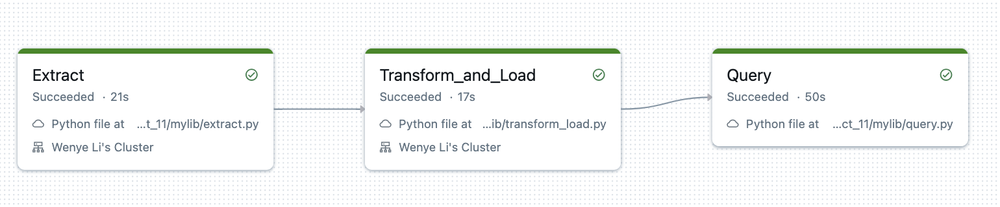

# Wenye Li Mini Project 11

## Overview
This project implements an ETL (Extract, Transform, Load) pipeline using Databricks to analyze drug usage patterns across different age groups.

## Project Features
- Complete ETL pipeline implementation in Databricks
- Data source: FiveThirtyEight drug usage dataset
- Data sink: Databricks Delta Lake tables
- Analysis of young adult drug usage patterns

## Dataset
The dataset comes from FiveThirtyEight, containing information about drug use by age. It includes usage statistics for various substances including alcohol, marijuana, cocaine, and heroin across different age groups.
Dataset source: https://raw.githubusercontent.com/fivethirtyeight/data/refs/heads/master/drug-use-by-age/drug-use-by-age.csv

## Pipeline Components
1. Data Extraction (extract.py)
2. Data Transformation and Loading
The pipeline processes the data by:
- Handling missing values (replacing "-" with NULL)
- Converting string values to appropriate numeric types
- Loading processed data into Delta table
3. Analysis Query
The main analysis focuses on young adult drug usage patterns

## Setup Instructions

1. Create a Databricks Cluster
   - Configure a new cluster in your Databricks workspace

2. Upload Pipeline Scripts
   - Upload the ETL scripts to your Databricks workspace
   - Ensure all dependencies are installed on your cluster

3. Create Databricks Job
   - Create a new job in Databricks Workflows
   - Configure the job to run the ETL pipeline scripts in sequence:
     1. Extract data
     2. Transform and load
     3. Run analysis query

## CI/CD Pipeline
The project includes automated CI/CD pipeline